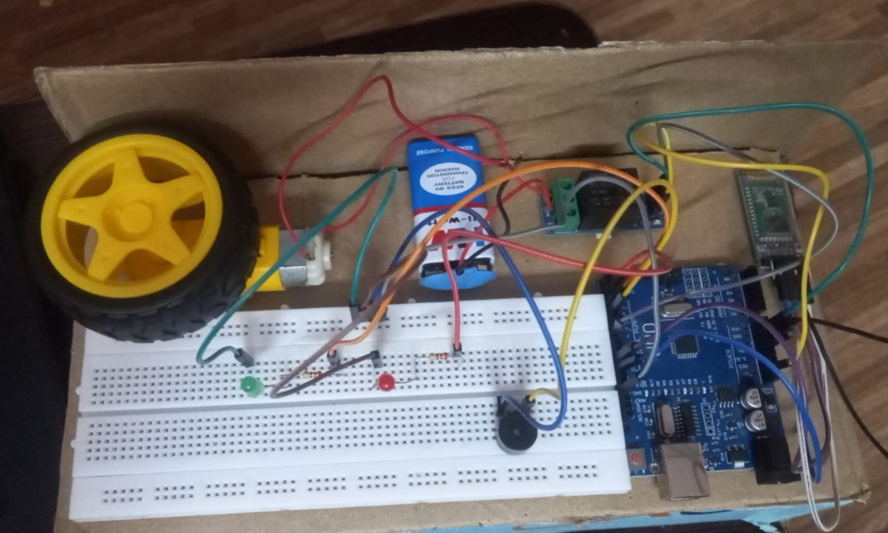
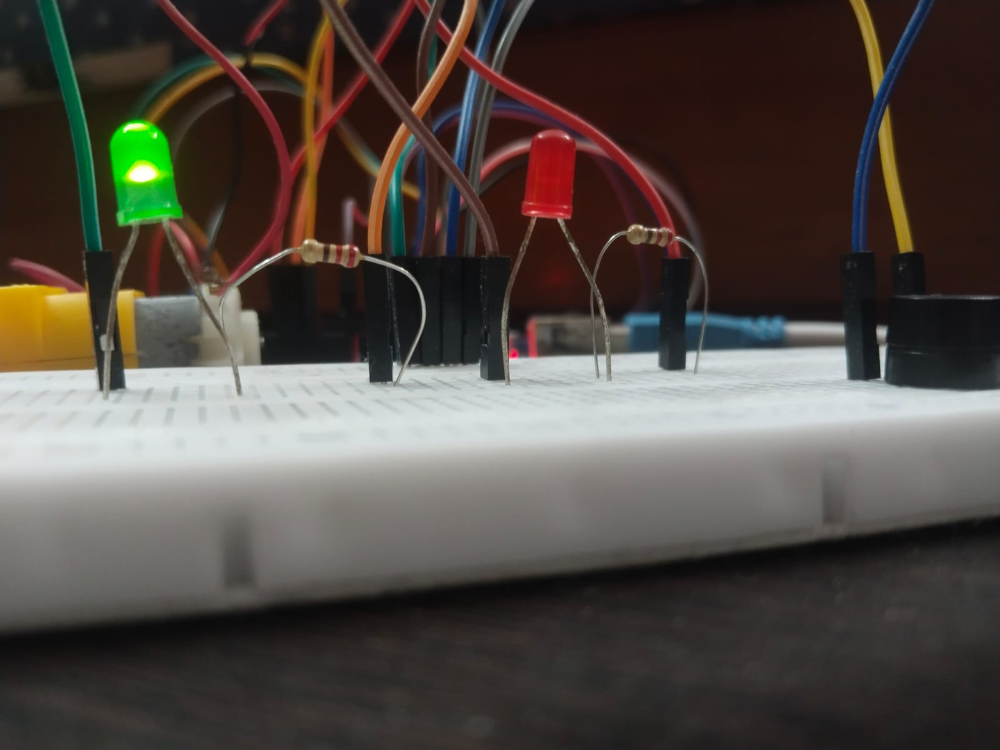
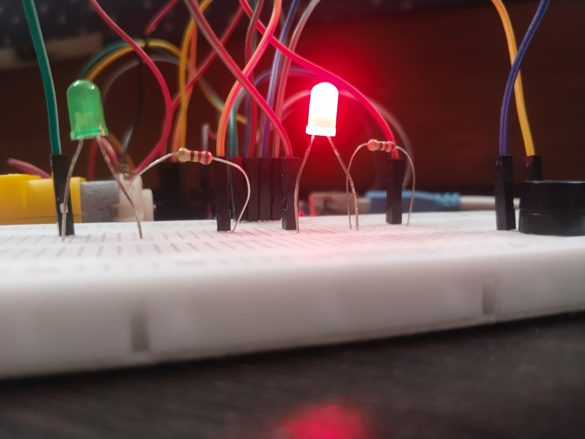

# Bluetooth-Based Automobile Security System

## Overview

The Bluetooth-Based Automobile Security System is an Arduino-based prototype designed to simulate basic automobile security and control functions through wireless Bluetooth communication.

The system uses an Arduino Uno and an HC-05 Bluetooth module to receive commands from a smartphone. Based on the authenticated commands, the system controls LEDs, a buzzer, a relay, and a DC motor to simulate vehicle locking, unlocking, and ignition operations.

## Objectives

* Develop a Bluetooth-enabled automobile security prototype.
* Implement wireless control of vehicle security functions.
* Provide password-based user authentication.
* Simulate vehicle locking, unlocking, and ignition control.
* Demonstrate communication between a smartphone and a microcontroller.

## Key Features

* Bluetooth-based wireless communication
* Password-based authentication
* Remote lock and unlock control
* Ignition simulation using a relay and DC motor
* LED-based system status indication
* Buzzer-based command acknowledgement
* Arduino-based control and processing

## Hardware Components

* Arduino Uno
* HC-05 Bluetooth Module
* Relay Module
* Red LED
* Green LED
* Buzzer
* DC Motor
* Resistors
* 9V Battery / USB Power Bank
* Smartphone

## System Architecture

```text
Smartphone
     |
     | Bluetooth
     v
  HC-05 Module
     |
     v
 Arduino Uno
     |
     +------------------+
     |        |         |
     v        v         v
   LEDs     Buzzer    Relay
                         |
                         v
                    DC Motor
                (Ignition Simulation)
```

## Pin Configuration

| Component | Arduino Pin |
| --------- | ----------- |
| HC-05 TX  | Pin 10      |
| HC-05 RX  | Pin 11      |
| Red LED   | Pin 2       |
| Green LED | Pin 3       |
| Buzzer    | Pin 4       |
| Relay     | Pin 7       |

A voltage divider is used for the HC-05 RX connection.

## Working Principle

1. The smartphone is paired with the HC-05 Bluetooth module.
2. The user sends the authentication password through a Bluetooth terminal application.
3. Arduino verifies the received password.
4. After successful authentication, the system accepts control commands.
5. Arduino processes the received command and activates the corresponding output.
6. LEDs, buzzer, relay, and DC motor provide the required system feedback.

## Authentication

The prototype uses password-based authentication before allowing vehicle control commands.

Authentication command:

```text
PWD:1234
```

Successful authentication:

```text
ACCESS GRANTED
```

If authentication is unsuccessful, control commands are rejected until the correct password is provided.

> Note: The password shown in this repository is intended only for this educational prototype and should not be considered a secure authentication mechanism for a real automobile.

## Bluetooth Commands

| Command  | Function                    |
| -------- | --------------------------- |
| `LOCK`   | Locks the vehicle           |
| `UNLOCK` | Unlocks the vehicle         |
| `START`  | Starts the simulated engine |
| `STOP`   | Stops the simulated engine  |

### System Feedback

| Output    | Indication                 |
| --------- | -------------------------- |
| Red LED   | Vehicle locked             |
| Green LED | Vehicle unlocked           |
| Buzzer    | Command acknowledgement    |
| DC Motor  | Ignition/engine simulation |

## Software Requirements

* Arduino IDE
* Arduino C/C++
* Bluetooth Terminal or Arduino Bluetooth Controller mobile application

## Project Structure

```text
Bluetooth-Automobile-Security-System/
│
├── README.md
│
├── src/
│   └── automobile_security_system.ino
│
├── circuit/
│   ├── circuit_diagram.png
│   └── pin_connections.md
│
├── images/
│   ├── project_model.jpg
│   └── working_demo.jpg
│
└── documentation/
    └── project_report.pdf
```

## Installation and Setup

### 1. Upload the Program

Open the Arduino `.ino` file using Arduino IDE and upload the program to the Arduino Uno.

### 2. Pair the Bluetooth Module

Pair the smartphone with the HC-05 Bluetooth module using the configured pairing PIN.

### 3. Connect to the Module

Open a Bluetooth terminal or compatible controller application and connect to the HC-05 module.

### 4. Authenticate

Send:

```text
PWD:_____
```

Wait for the authentication confirmation.

### 5. Control the System

After successful authentication, send:

```text
LOCK
UNLOCK
START
STOP
```

to operate the corresponding functions.

## Project Images

### Project Model



### Working Demonstration




## Future Improvements

* Implement stronger authentication mechanisms.
* Develop a dedicated mobile application.
* Add GPS-based vehicle tracking.
* Implement intrusion detection and alert notifications.
* Integrate IoT connectivity for remote monitoring.
* Add additional vehicle security features.

## Documentation

The complete project report, circuit diagram, and source code are included in this repository.

## Project Status

**Status: Completed Prototype**

This project was developed as an academic prototype to demonstrate Bluetooth communication, microcontroller control, authentication, and automobile security concepts.

## Author

**Keerthika Srinivasan**

Electronics and Communication Engineering

## License

This project is intended for educational and academic purposes.
